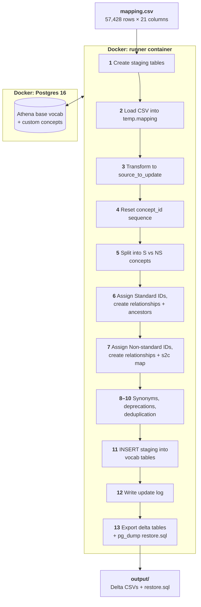

# EU2_Flowsheets — Custom Vocabulary

Custom OMOP vocabulary for ~55,900 Epic EU2 flowsheet items. Maps source flowsheet codes to standard OMOP concepts (SNOMED, LOINC, etc.) and assigns custom concept IDs in the 2001000000–2002000000 range.

## Pipeline Overview



| Step | Script | What it does |
|------|--------|-------------|
| 1 | `source-ddl.sql` | Create `temp.mapping` and `temp.source_to_update` staging tables |
| 2 | `trim-csv-columns.py` + `\copy` | Strip workspace columns, load CSV into `temp.mapping` |
| 3 | `load-source.sql` | Transform raw columns → normalized `temp.source_to_update` |
| 4 | `revert-id-sequence.sql` | Reset `concept_id` sequence to start of allocated range |
| 5 | `evaluate-difference.sql` | Split items into Standard (S) vs Non-standard (NS) concept sets |
| 6 | `update-standard.sql` | Assign S concept IDs, create self-ref relationships + ancestors |
| 7 | `update-nonstandard.sql` | Assign NS concept IDs, create target relationships + s2c map entries |
| 8–10 | `update-synonym.sql`, `deprecate-and-update.sql`, `pre-update.sql` | Stage synonyms, detect mapping changes, deduplicate |
| 11 | `execute-core-update.sql` | INSERT all staging → `vocab.*` tables |
| 12 | `message-log.sql` | Write row counts to update log |
| 13 | `create-delta-tables.sql` + `pg_dump` | Export custom concept range to delta CSVs + `restore.sql` |

## What Each Step Does

### Concept creation

Every source item (unique `source_concept_code`) gets **two** custom concepts:

| Type | Range | `standard_concept` | Purpose |
|------|-------|--------------------:|---------|
| **Standard (S)** | 2001471617–2001499998 | `'S'` | The "anchor" concept — always created, even for `noMatch` items |
| **Non-standard (NS)** | 2001500001–2001555931 | `NULL` | Points to standard OMOP targets via relationships |

### Relationship generation

Relationships are created based on `predicate_id` and `relationship_id` from the mapping:

| predicate_id | relationship_id | Creates |
|---|---|---|
| `exactMatch` | `Maps to` | NS → target via `Maps to` / `Mapped from` |
| `broadMatch` | `Maps to` | NS → target via `Maps to`; S → target via `Is a` / `Subsumes` |
| `narrowMatch` | `Maps to` | NS → target via `Maps to`; S → target via `Subsumes` / `Is a` |
| `relatedMatch` | `Maps to` | NS → target via `Maps to`; S → target via domain-specific (e.g., `Has asso finding`) |
| any | `Has finding site` | Compositional qualifier: S → body site concept |
| any | `Has laterality` | Compositional qualifier: S → laterality concept |
| any | `Has method` | Compositional qualifier: S → method concept |
| any | `Has proc site` | Compositional qualifier: S → procedure site concept |
| `noMatch` | *(empty)* | S concept only — self-referencing `Maps to` (no external target) |

All relationships include reverse directions (e.g., `Has finding site` ↔ `Finding site of`).

### Delta tables (output)

| File | Rows | Purpose |
|------|------|---------|
| `concept_delta.csv` | 84,313 | All custom S + NS concepts |
| `concept_relationship_delta.csv` | 171,564 | All relationships (forward + reverse) |
| `concept_ancestor_delta.csv` | 28,382 | Hierarchy entries for S concepts |
| `source_to_concept_map_delta.csv` | 55,915 | ETL lookup: source_code → target |
| `mapping_metadata_delta.csv` | 57,427 | Provenance per mapping row |
| `concept_relationship_metadata_delta.csv` | 29,019 | OHDSI-aligned predicate/confidence metadata |
| `restore.sql` | — | Full pg_dump of all delta tables |

## Running

```bash
# From repo root
docker compose run --rm runner EU2_Flowsheets/Builder/execute-pipeline.sh

# To reset and re-run
docker compose run --rm runner EU2_Flowsheets/Builder/revert-db.sh
docker compose run --rm runner EU2_Flowsheets/Builder/execute-pipeline.sh
```

Output lands in `./output/` on the host (mounted from `/tmp/output` in the container).

## Directory Structure

```
EU2_Flowsheets/
├── vocab.env                          # ID ranges, DB name, file list
├── Builder/
│   ├── execute-pipeline.sh            # 12-step orchestration
│   ├── revert-db.sh                   # Wipe custom concepts + re-register
│   └── sql/
│       ├── source-ddl.sql             # Staging table DDL (vocab-specific)
│       ├── load-source.sql            # CSV → source_to_update transform (vocab-specific)
│       └── create-general-concepts.sql # Vocabulary registration (run once)
├── Mappings/
│   ├── mapping.csv                    # 57,428 rows — the pipeline input
│   ├── clinical_review.csv            # 38,192 unmappable items (source)
│   ├── atomic_review.csv              # 4,000 reviewed items (source)
│   └── backups/                       # Timestamped backups (gitignored)
└── Ontology/                          # Delta tables copied from output/
```

Shared pipeline SQL lives in `Builder/sql/shared/` at the repo root.

## Key Decisions

1. **Fix at source** — hallucinated concept_ids corrected in review CSVs before building mapping.csv
2. **Vocab is truth** — concept names, domains, vocabulary_ids derived from OMOP vocab, not LLM
3. **SSSOM predicates** — normalized to exactMatch, broadMatch, narrowMatch, relatedMatch, noMatch
4. **Compositional mappings** — multi-row: same source_concept_code with different relationship_ids (e.g., `Maps to` + `Has finding site`)
5. **No LLM as data bus** — concept_ids flow DB → file, never through LLM context
