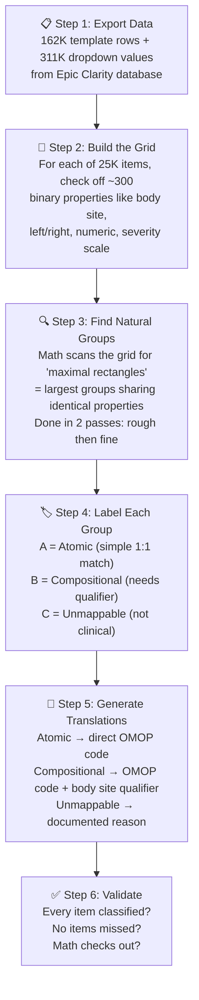
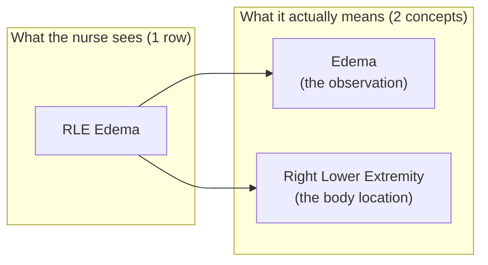
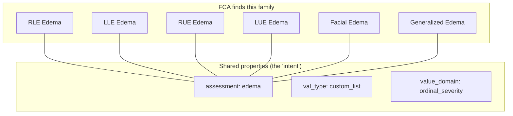
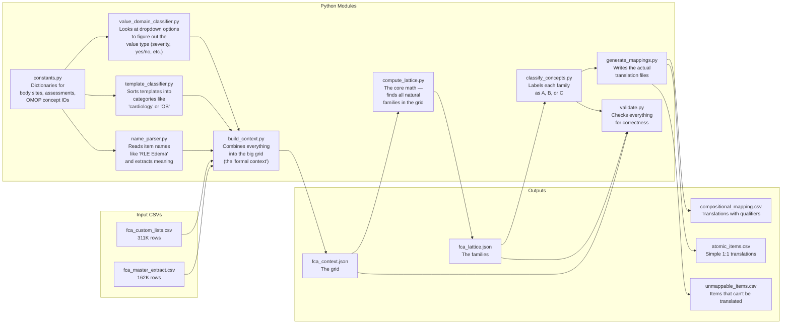

# FCA Flowsheet Mapping Pipeline

## What is this?

Hospitals record patient data using **flowsheet items** — things like "Heart Rate", "RLE Edema", or "Breath Sounds Left." Our hospital has **25,166** of these items, and we need to translate each one into a standard medical coding system called **OMOP** so researchers can study the data.

The catch: many flowsheet items aren't simple. "RLE Edema" really means **two things at once**: "Edema" (the observation) + "Right Lower Extremity" (the body location). There's no single standard code for that combination. We can't just match them one-to-one.

This pipeline uses a branch of mathematics called **Formal Concept Analysis (FCA)** to automatically find families of related items, figure out what each family means, and generate the right translations — including the ones that need two codes instead of one.

## How it works

Think of it like sorting a giant pile of LEGO pieces. Instead of examining each piece individually, you dump them onto a grid, check off their properties (color, size, shape), and let the math find which pieces naturally belong together.



## The key insight

Many flowsheet items are **compositional** — they bundle multiple clinical ideas into one row:



FCA discovers these compositions automatically by finding items that share the same properties:



All six items share the same clinical assessment (edema) with the same value options (None/Trace/1+/2+/3+/4+). They differ only in body site. So a human reviewer approves the **family once**, not each item separately.

## What each file does



## The three categories

| Category | What it means | Example | How it maps | ~Count |
|----------|--------------|---------|-------------|--------|
| **A (Atomic)** | A simple, standalone clinical item | Heart Rate, SpO2, Pain Score | One source item → one OMOP code | ~1,000 |
| **B (Compositional)** | Bundles body site or laterality with an assessment | RLE Edema, L Breath Sounds, R Pupil Size | OMOP observation code + body site qualifier | ~15,000 |
| **C (Unmappable)** | Administrative, workflow, or not clinical | "Did patient follow plan?", template headers | Documented as noMatch with a reason | ~9,000 |

## Running the pipeline

```bash
cd /Users/danielsmith/git_repos/org__Emory-OMOP/CVB/EU2_Flowsheets
uv sync
bash fca/run_pipeline.sh
```

### Prerequisites

- Python 3.11+
- [uv](https://docs.astral.sh/uv/) package manager
- Input CSVs in `raw_for_fca/` (exported from Epic Clarity)

### Input files

| File | Source | Rows |
|------|--------|------|
| `raw_for_fca/fca_master_extract*.csv` | Clarity 4-table join (template → group → row) | ~162K |
| `raw_for_fca/fca_custom_lists*.csv` | Clarity IP_FLO_CUSTOM_LIST | ~311K |

### Output files

| File | Location | Description |
|------|----------|-------------|
| `fca_context.json` | `raw_for_fca/` | The formal context (item list + attribute list) |
| `fca_incidence.npz` | `raw_for_fca/` | Sparse binary matrix (items × attributes) |
| `fca_metadata.json` | `raw_for_fca/` | Per-item metadata for downstream use |
| `fca_lattice.json` | `raw_for_fca/` | Concept lattice (all families found) |
| `fca_classification.json` | `raw_for_fca/` | A/B/C category for each family |
| `fca_validation.json` | `raw_for_fca/` | Validation report |
| `compositional_mapping.csv` | `Mappings/` | Translations needing body site qualifiers |
| `atomic_items.csv` | `Mappings/` | Simple 1:1 translation candidates |
| `unmappable_items.csv` | `Mappings/` | Items that can't be translated, with reasons |

## Why FCA instead of doing it by hand?

| | Doing it by hand | FCA pipeline |
|---|---|---|
| **Reviews needed** | 25,166 items, one at a time | ~500–2,000 families |
| **Can items slip through?** | Yes — easy to miss some | No — mathematically guaranteed complete |
| **Reproducible?** | Depends on who does it | Same input always gives same output |
| **Body site preserved?** | Often lost (mapped to generic "Edema") | Kept via qualifier codes |
| **New items added later?** | Start from scratch | Automatically inherit family mapping |

## References

- Ganter, B. & Wille, R. (1999). *Formal Concept Analysis: Mathematical Foundations.* Springer.
- Wille, R. (1982). "Restructuring lattice theory." *Ordered Sets*, NATO ASI Series.
- [SSSOM Specification](https://mapping-commons.github.io/sssom/) — mapping provenance standard
- [OHDSI Forums: Representing Laterality](https://forums.ohdsi.org/t/representing-laterality-general-questions-about-post-coordination/16872)
