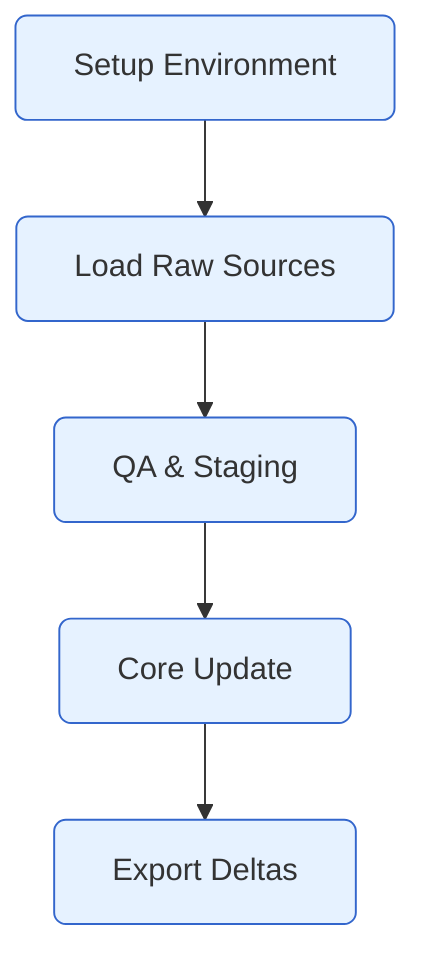
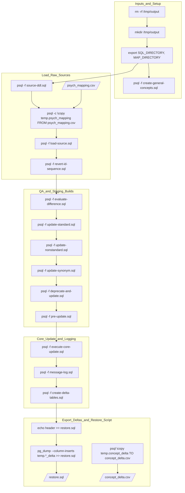

# Psychiatry Vocabulary Pipeline

This repository documents the ETL pipeline for building and exporting psychiatry vocabulary data.  Below are two different levels of explanation: detailed (for developers) and high-level (for stakeholders).

---

## High level Pipeline
At a high level, the pipeline has five phases:
- Setup Environment – initialize folders and variables.
- Load Raw Sources – ingest CSV mapping files.
- QA & Staging – check data quality and prep staging tables.
- Core Update – update vocabulary tables.
- Export Deltas – export changes for integration.

## Detailed Technical Pipeline
This diagram shows each command in the ETL process:
- Setup: prepare temp folders and environment.
- Load: create source tables and load mapping CSVs.
- QA/Staging: validate, clean, and prepare data.
- Update: apply core updates to vocabulary tables.
- Export: dump delta tables and export CSVs for downstream use.

