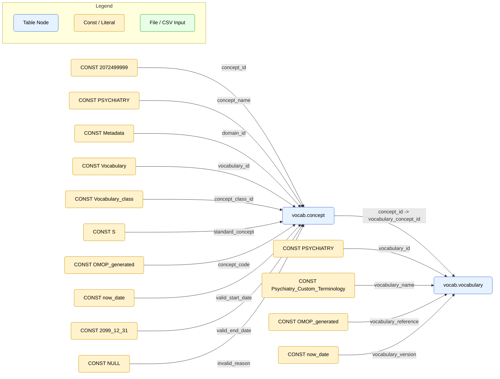

# project flow

## Lineage Diagrams

### Step 1: create-general-concepts

**Purpose**: Registers the custom PSYCHIATRY vocabulary by creating a new concept in vocab.concept and linking it in vocab.vocabulary. This establishes the anchor point for all subsequent mappings and updates.

**Why it Matters**: This step is like adding a new “dictionary” to OMOP. By inserting PSYCHIATRY into both concept and vocabulary, all later mappings and updates know where to attach psychiatry-specific concepts. Without this anchor, the pipeline would have no recognized home for the new terminology.

