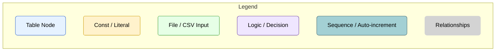
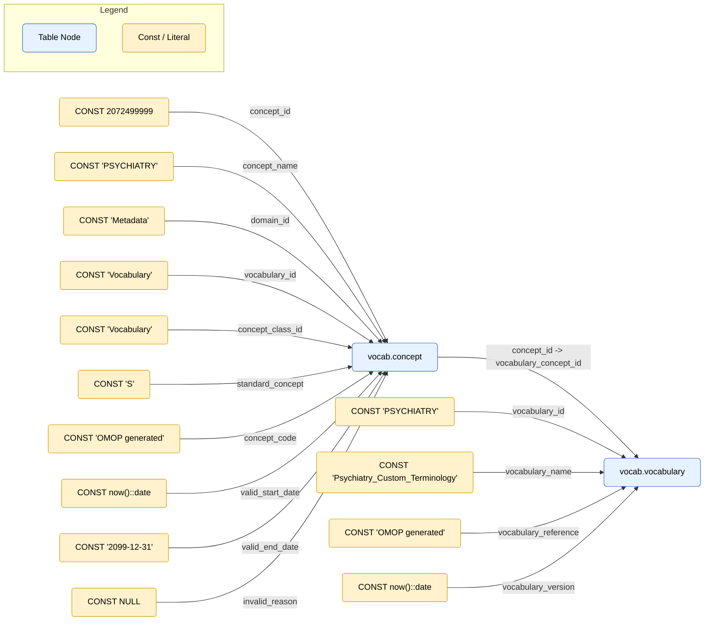
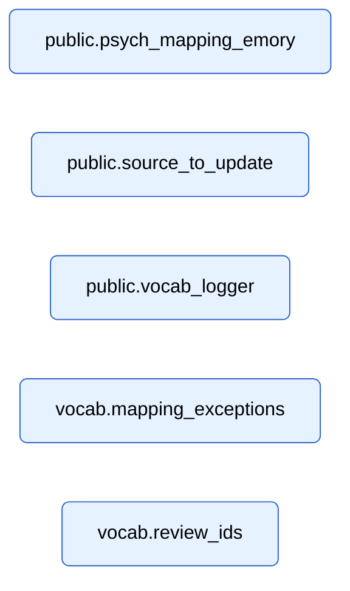
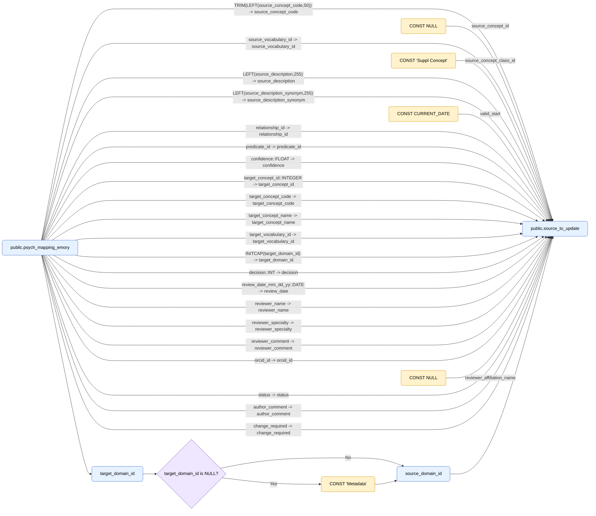
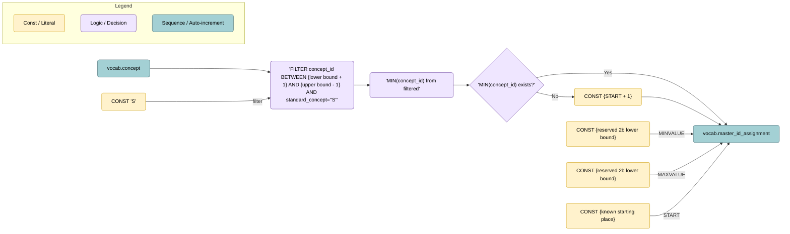
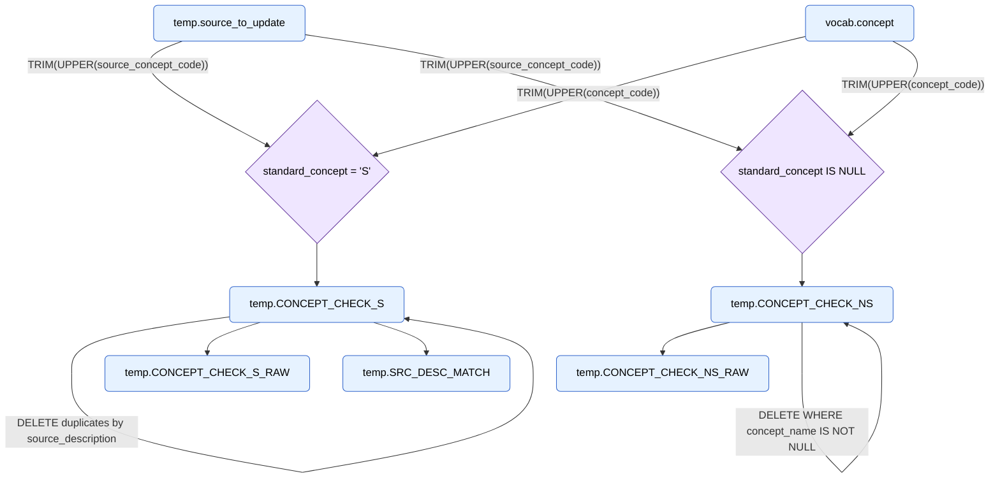

# project flow

## Lineage Diagrams

### Legend

### Step 1: create-general-concepts

**Purpose**: Registers the custom PSYCHIATRY vocabulary by creating a new concept in vocab.concept and linking it in vocab.vocabulary. This establishes the anchor point for all subsequent mappings and updates.

**Why it Matters**: This step is like adding a new “dictionary” to OMOP. By inserting PSYCHIATRY into both concept and vocabulary, all later mappings and updates know where to attach psychiatry-specific concepts. Without this anchor, the pipeline would have no recognized home for the new terminology.

### Step 2: source-ddl.sql
**Purpose:**
Creates the staging and helper tables used throughout the pipeline: pubilc.psych_mapping_emory, public.source_to_update, public.vocab_logger, and ensures permanent helper tables vocab.mapping_exceptions and vocab.review_ids exist.

**Why it matters:**
These tables are the workspace and control tables for loading raw mappings, tracking review metadata, logging counts/messages, and handling exception/reviewer lookups. Without them, later steps that load CSVs, transform mappings, and compute deltas have nowhere to land or reference.

### Step 3: load-source.sql
**Purpose:**
Transforms rows from temp.psych_mapping into a normalized staging table temp.source_to_update, applying trims, length caps, casts, default class/domain, date normalization, and simple casing.

**Why it matters:**
This step converts the raw mapping sheet into a typed, consistent staging shape used by all downstream QA and update logic. It enforces basic hygiene (non-blank codes/descriptions, safe string lengths, domain defaults, type casts) so later SQL can rely on schema-clean inputs.

### Step 4a: revert-id-sequence.sql

**Purpose:**
Drops/recreates vocab.master_id_assignment to generate descending custom IDs in a reserved range, then setval to the minimum available concept ID (or a fallback).

**Why it matters:**
This ensures stable, unique IDs for new psychiatry concepts that don’t overlap with OMOP core IDs. By anchoring the sequence in a controlled range, the pipeline can always assign valid identifiers without clashing with upstream vocabularies.

### Step 4b: revert-id-sequence.sql

**under construction here! complex step**

**Purpose:**
Builds check tables (temp.CONCEPT_CHECK_S, temp.CONCEPT_CHECK_NS and their raw/working copies) to compare new psychiatry mappings against existing vocabularies. It flags duplicates, exact matches, and assigns candidates for standard/non-standard IDs.

**Why it matters:**
This step is the quality gate: it filters out mappings that are already present, identifies potential duplicates, and isolates only the novel custom concepts. Without it, the pipeline could introduce redundant or conflicting concept definitions into the OMOP vocabulary.

