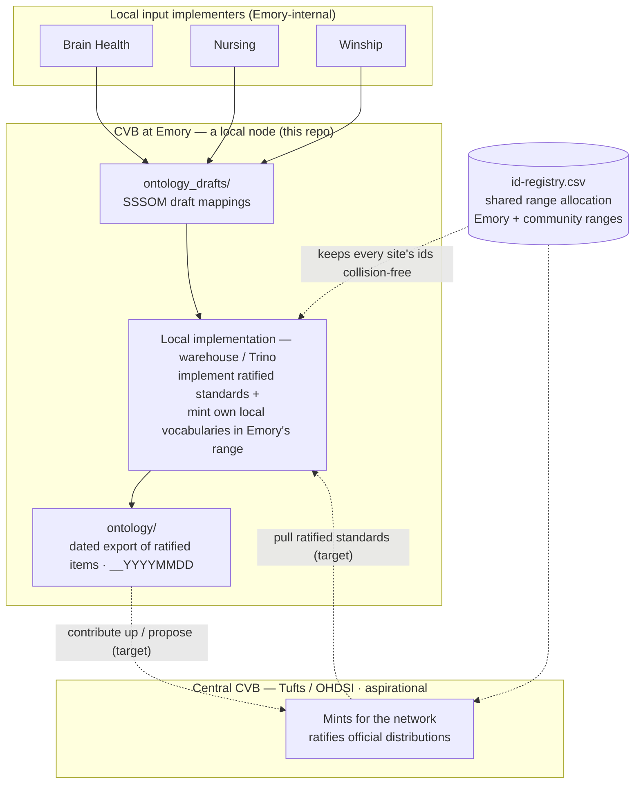

# CVB Architecture — CVB at Emory, within the shared custom-vocabulary exchange

> **Status of this document.** This describes what CVB *is for* — its target architecture as the shared custom-vocabulary layer for the Tufts CHoRUS CVB implementers, **and specifically what CVB at Emory is** within it. Much of it is **not yet built** (see §6, Current state). It is a definitional architecture, authored and maintained by the `cvb-architecture` steward; design *decisions* with their deliberation history live in [`cvb_builder_ADR.md`](cvb_builder_ADR.md). Where a claim describes intent rather than shipped code, it is marked **(target)**.
>
> **Terminology.** *Central CVB* means the network-wide commons (the Tufts/OHDSI CVB). *CVB at Emory* means this repo (`Emory-OMOP/CVB`), Emory's node in that federation. Where this document says "CVB" unqualified, it means **CVB at Emory**.

## 1. What CVB is

**Central CVB** is the **central sharing surface for custom-vocabulary ontologies** across the Tufts CHoRUS CVB implementers — the commons where SSSOM-compliant mapping drafts and ratified ontology exports are shared, and where Tufts sanctions official distributions. It carries the network-wide standard.

**CVB at Emory** (this repo) is Emory's node in that federation. Its job is the **smallest interoperable surface between sites *while still upkeeping the network's evolving standards*** — it holds Emory's drafts, ratified exports, and Emory's slice of the shared id-range registry in the common format, and it continuously tracks and adopts the community's evolving conventions (SSSOM conformance, the sanctioned id ranges, the CHoRUS/OHDSI vocabulary standards as they change). So CVB at Emory is both a *participant* in the sharing and a *tracker* of the moving standard: it must stay current so Emory remains interoperable as the network evolves. That upkeep is a standing responsibility, not a one-time setup — and it is part of what the `cvb-architecture` steward maintains.

The two levels are not the same thing, and this document qualifies which it means throughout.

**Central CVB mints for the network; locals implement the ratified standards — and also come up with their own.** Two kinds of custom concepts live at a local site:

1. **Ratified network standards** — minted by *central CVB*, pulled down and *implemented* by locals (applied to their own data and CDM). The authoritative, network-official `concept_id`s are central CVB's.
2. **A local's own custom vocabularies** — the site *comes up with these itself* for its own needs, mints them provisionally within its allocated range, and uses them locally. It *may* contribute them up to central CVB for ratification (promoting a local vocabulary into a network standard), or keep them purely local.

So a local's ontology is the union of *(the ratified network standards it implements)* + *(its own local custom vocabularies)*. The shared id-range registry (§4) is what keeps those two — and every other site's — from colliding: each mints only in its own sanctioned range. Until central CVB ratifies a locally-minted vocabulary, its ids are a **proposal**, authoritative only locally.

For Emory specifically: Emory both *implements* ratified standards **and** *mints its own* local custom vocabularies and stages proposals. The **mint code is part of this repo** (`Emory-OMOP/CVB`) — Emory's local implementation of CVB, the warehouse-native successor to the retired Postgres Builder — and it **executes in AWS account 416** (Glue/Athena/S3), reading `mapping_sssom` and the vocabulary bundle there. It is **not** in `emory_omop_enterprise` (that is the OMOP CDM/ETL pipeline, a separate concern). The division of labor: the **network-authoritative ratified mint is central CVB's**; a **site's own-vocabulary mint and its implementation of ratified standards are the site's** — code here, execution in the site's own infrastructure (Emory's is account 416).

**What CVB at Emory is not:**
- Not the network mint authority (central CVB mints the ratified standard; Emory implements it, and separately mints/proposes its own).
- Not the source of truth for Emory's implemented data (that is Emory's local database; CVB holds shared drafts + ratified exports).
- Not a live federation yet (§6) — the up/down sync with central CVB, and central ratification, are aspirational.

## 2. The federation model

*Solid edges are the local flow; dashed edges are the aspirational federation boundary (not built — §6).* Two flows at that boundary:
- **Contribute up (target):** a site pushes its ratified ontology up to central CVB, which mints/ratifies it for the network as an official distribution.
- **Pull down (target):** a site takes what central CVB has ratified and implements those *exact* items locally, provided there is no conflict (conflict-testing is deferred — §7).

The invariant that makes this safe is the shared **id-range registry** (§4): every site mints only inside its own sanctioned 2B block, so ontologies are portable across sites without id collisions.

## 3. Two meanings of "community" — kept distinct

These are different roles and the architecture treats them separately:

| | Who | Role |
|---|---|---|
| **Local input implementers** | Brain Health, Nursing, Winship (Emory-internal groups) | *Produce mappings.* They author SSSOM-compliant drafts and contribute them into the site's `ontology_drafts/`. |
| **Central (Tufts)** | The CHoRUS / OHDSI CVB authority | *Sanctions outputs.* Defines the definitive accepted mappings that become official distributions and are absorbed into sites' deltas. |

Local implementers feed *inputs*; Tufts ratifies *outputs*. Conflating them was an early error in the design discussion; they never merge.

## 4. The shared artifacts

### 4.1 `ontology_drafts/` — the input surface *(renamed from `Mappings/`)*

SSSOM-compliant *draft* mappings, one curated sheet per vocabulary, contributed by local input implementers via pull request. This is the human curation and review surface: git gives it provenance, PR review, and CI conformance-gating. A draft carries the proposed mapping — source code, predicate, target concept, metadata — and, optionally, a self-assigned `source_concept_id` (§5).

### 4.2 `ontology/` — the ratified export *(renamed from `Ontology/`)*

The *ratified* items, **exported from the local database** (the full CVB pipeline) as a dated, immutable snapshot (`…__YYYYMMDD`). Explicitly **not the source of truth** — the site's local database is — but the shareable, frozen form of what has been ratified. The dated versioning means the original export is never overwritten in place; each ratification emits a new dated snapshot.

### 4.3 `id-registry.csv` — the range-allocation authority

The load-bearing shared coordination. It records which half-open 2B `[min, max)` range each vocabulary owns, so no two sites (or vocabularies) ever mint the same id. **(target)** It is extended to also record the *community's* sanctioned ranges — so that when Emory pulls a community vocabulary down, or mints a new one, it can verify against the full known allocation and never step on another site's space.

## 5. Local implementers and the verify-or-mint boundary

The actors here are the **local input implementers** (Brain Health, Nursing, Winship, …) — the internal groups that author SSSOM draft mappings. This section is about *their* contribution boundary, not the cross-site federation (§2). Each local implementer **may or may not contribute its own `source_concept_id`s**, and if it does, they must fall within its allocated range. `source_concept_id` in a draft is therefore **optional**:

- **Present** → the local implementer provisionally minted the id itself, within its allocated (sub-)range. CVB **verifies** rather than assigns.
- **Absent** → the local implementation (Emory's warehouse) mints it.

Verification is two fail-loud checks, enforced **at CI on the pull request** so a bad id never enters the drafts:
1. **Range membership** — the id sits inside that local implementer's allocated (sub-)range.
2. **Conflict-freedom** — the id is not already assigned to a different `(vocabulary_id, source_concept_code)`, and that code does not already carry a different id (no silent reassignment — ids are stable forever).

CI checks against the latest exported snapshot; the local implementation's uniqueness assertion is the authoritative backstop for the race between snapshots.

This is the per-implementer view of the shared range registry (§4.3): within Emory's block, each local implementer may hold a sub-range it mints in, and the registry keeps those sub-ranges non-overlapping.

## 6. Current state — honest inventory

**None of the federation is live.** As of today:
- There is no central Tufts/OHDSI CVB repo sync — no pull, no push, no approval loop. CVB is Emory's repo of drafts.
- The folder rename (`Mappings/` → `ontology_drafts/`, `Ontology/` → `ontology/`) is **(target)**; the repo still uses the old names.
- The Postgres Builder that historically minted inside this repo is **retired** (see the retirement decision in `cvb_builder_ADR.md`). Emory's minting moves to the warehouse.
- `Ontology/` holds no committed baseline for the live packages; the dated-export model is not yet producing snapshots.

What *does* exist today: the draft sheets themselves (EU1_CDW, EU2_Flowsheets), `id-registry.csv` as the range authority, the SSSOM validator and CI, and the current publish path (the mapping sheet published to the warehouse as `omop_etl.mapping_sssom`).

**Nothing that exists today is load-bearing on the target.** Current artifacts — `omop_etl.mapping_sssom`, the publish path that feeds it, the folder names, the current warehouse tables — exist, but they are **not permanent**. The target architecture is free to redefine or retire any of them; where it diverges, they are migrated or dropped, not preserved for their own sake. In particular, `mapping_sssom` is a current implementation detail of getting drafts into the warehouse, not a fixed part of the contract. The only things the design treats as durable-by-intent are the *contract* pieces — SSSOM conformance, the `id-registry.csv` range allocation, and the stable-forever property of a ratified `concept_id` once published.

## 7. Out of scope / open questions

Deliberately **not** defined here — each has a home elsewhere:
- **The local mint internals** (how Emory assigns ids, the registry substrate, the merged concept surface, freeze-vs-track of descriptive fields, `domain_id` gating) → Emory's local implementation. Its **code lives in this repo** (the warehouse-native successor to the retired Postgres Builder); it **executes in AWS account 416** (Glue/Athena/S3) — **not** `emory_omop_enterprise`. Out of scope for *this* (exchange) document; the mint is its own build.
- **Tufts's central approval process** → the central authority's, not ours.
- **Conflict-testing on pull** — how a pulled community item is checked against local state before use → deferred; flagged for a later design pass.
- **Whether `Emory-OMOP/CVB` is the local node or becomes the central repo** — the up/down sync is aspirational; the relationship to a future central repo is undecided.
